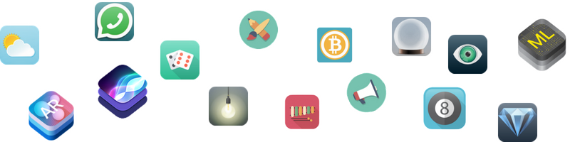

# 🎲 Dicee

A simple yet elegant dice-rolling iOS app built with **UIKit** and **Swift**.


## 📱 About

Dicee is a Las Vegas-style dice app that lets you roll two dice at the press of a button. Whether you need to settle a score or make a quick decision, Dicee has you covered.

## ✨ Features

- 🎯 Roll two dice simultaneously with a single tap
- 🎨 Clean and intuitive user interface
- ⚡ Instant random dice generation using Swift's `randomElement()`

## 🛠 Tech Stack

| Technology       | Details            |
| ---------------- | ------------------ |
| **Language**     | Swift 5            |
| **UI Framework** | UIKit (Storyboard) |
| **IDE**          | Xcode 15+          |
| **Min. iOS**     | iOS 13.0           |
| **Architecture** | MVC                |

## 📂 Project Structure

```
Dicee-iOS13/
├── AppDelegate.swift          # Application lifecycle
├── SceneDelegate.swift        # Scene lifecycle (iOS 13+)
├── ViewController.swift       # Main dice-rolling logic
├── Base.lproj/
│   ├── Main.storyboard        # Main UI layout
│   └── LaunchScreen.storyboard
├── Assets.xcassets/
│   ├── DiceOne – DiceSix      # Dice face images
│   ├── DiceeLogo              # App logo
│   └── GreenBackground        # Background image
└── Info.plist
```

## 🚀 Getting Started

### Prerequisites

- macOS with **Xcode 15** or later
- iOS 13.0+ simulator or physical device

### Installation

1. Clone the repository:
   ```bash
   git clone https://github.com/appbrewery/Dicee-iOS13.git
   ```
2. Open `Dicee-iOS13.xcodeproj` in Xcode
3. Select a simulator or connected device
4. Press **⌘ + R** to build and run

## 🙏 Credits

> This is a companion project to [The App Brewery's Complete App Development Bootcamp](https://www.appbrewery.co/).


