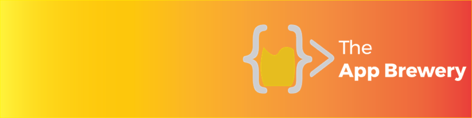

# 🎱 Magic 8 Ball

A classic Magic 8 Ball app built with **UIKit** for iOS. Ask a question, tap the button, and let fate decide your answer.



## Overview

Magic 8 Ball is a simple, fun iOS application that randomly displays one of five possible answers whenever the user taps the "Ask" button. The app demonstrates fundamental iOS development concepts including IBOutlets, IBActions, and working with Asset Catalogs.

## Features

- 🎲 Random answer generation using Swift's `randomElement()` API
- 🖼️ Five unique 8-ball response images
- 🎨 Clean, single-screen interface with a system blue background

## Tech Stack

| Technology         | Details                         |
| ------------------ | ------------------------------- |
| **Language**       | Swift 5                         |
| **Framework**      | UIKit                           |
| **UI**             | Storyboard (Interface Builder)  |
| **Architecture**   | MVC                             |
| **Minimum Target** | iOS 13.0                        |
| **Lifecycle**      | UIScene-based (`SceneDelegate`) |

## Project Structure

```
Magic 8 Ball/
├── AppDelegate.swift          # Application lifecycle
├── SceneDelegate.swift        # Scene lifecycle (iOS 13+)
├── ViewController.swift       # Main view controller with game logic
├── Base.lproj/
│   ├── Main.storyboard        # Primary UI layout
│   └── LaunchScreen.storyboard
├── Assets.xcassets/
│   ├── AppIcon.appiconset/
│   ├── ball1–ball5.imageset/  # 8-ball answer images
│   └── Contents.json
└── Info.plist
```

## Getting Started

### Prerequisites

- Xcode 15.0+
- iOS 13.0+ deployment target

### Installation

1. Clone the repository:
   ```bash
   git clone https://github.com/appbrewery/Magic-8-Ball-iOS13.git
   ```
2. Open `Magic 8 Ball.xcodeproj` in Xcode.
3. Select a simulator or connected device, then press **⌘R** to build and run.

## How It Works

The core logic resides in [`ViewController.swift`](Magic%208%20Ball/ViewController.swift):

1. An array holds five image assets representing different 8-ball answers.
2. The `askActionPressed(_:)` IBAction is triggered when the user taps the "Ask" button.
3. `randomElement()` selects a random image from the array and assigns it to the `UIImageView`.

## Roadmap

### Phase 1 — Critical Fixes

- [ ] **Auto Layout Constraints** — Replace all `fixedFrame` layouts with proper Auto Layout constraints to support every screen size (SE → Pro Max → iPad)
- [ ] **Replace Image Literals** — Migrate from `#imageLiteral` to `UIImage(named:)` for better readability in code reviews, diffs, and CI/CD pipelines
- [ ] **Outlet Naming & Access Control** — Rename `ballUIImage` → `ballImageView` and mark outlets as `private`

### Phase 2 — UX Enhancements

- [ ] **Answer Transition Animation** — Add `UIView.transition` with cross-dissolve effect when a new answer appears
- [ ] **Haptic Feedback** — Trigger `UIImpactFeedbackGenerator` on button tap for tactile response
- [ ] **Accessibility Support** — Add `accessibilityLabel` and `accessibilityHint` to all interactive elements for VoiceOver compatibility
- [ ] **Shake-to-Ask** — Implement `motionEnded(.motionShake, …)` as an alternative input method

### Phase 3 — Architecture Modernization

- [ ] **Extract Model Layer** — Create a `MagicBall` model struct to separate data/logic from the view controller
- [ ] **MVVM Refactor** — Introduce `MagicBallViewModel` to decouple presentation logic from UIKit
- [ ] **SwiftUI Migration** — Rebuild the UI in SwiftUI with `@StateObject` and `@Published` bindings
- [ ] **Migrate to `@main`** — Replace deprecated `@UIApplicationMain` with the modern `@main` attribute

### Phase 4 — Quality & Testing

- [ ] **Unit Tests** — Test randomness distribution and model correctness with `XCTest`
- [ ] **UI Tests** — Verify button tap updates the image view using `XCUITest`
- [ ] **SwiftLint Integration** — Add `.swiftlint.yml` and enforce consistent code style
- [ ] **CI/CD Pipeline** — Configure GitHub Actions for automated build, lint, and test on every push

## Acknowledgements

> This is a companion project to [The App Brewery's Complete App Development Bootcamp](https://www.appbrewery.co/).


